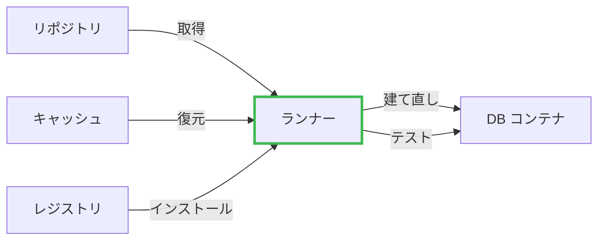

## ビルドの流れ

```mermaid
flowchart LR
  repo["リポジトリ"] -- "取得" --> runner["ランナー"]
  cache["キャッシュ"] -- "復元" --> runner
  registry["レジストリ"] -- "インストール" --> runner
  runner -- "建て直し" --> db["DB コンテナ"]
  runner -- "テスト" --> db
  classDef added stroke:#3fb950,stroke-width:3px
  class runner added
```

ランナーが 3 か所から材料を集め、DB コンテナを立ててテストを流す。
緑の枠が今回足した部品。

- 図は数えず、この箇条と上の文だけを数える
  - 合わせて 6 行
